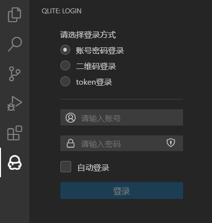
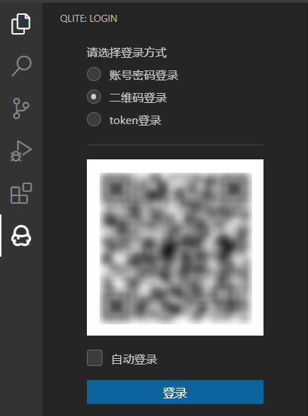
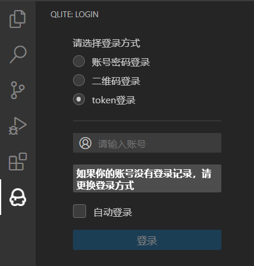
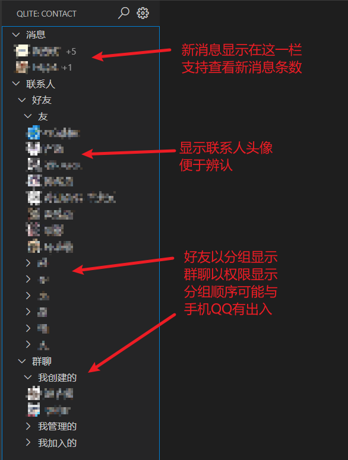
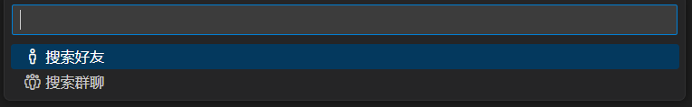
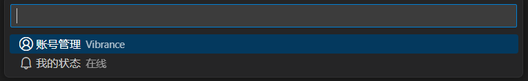
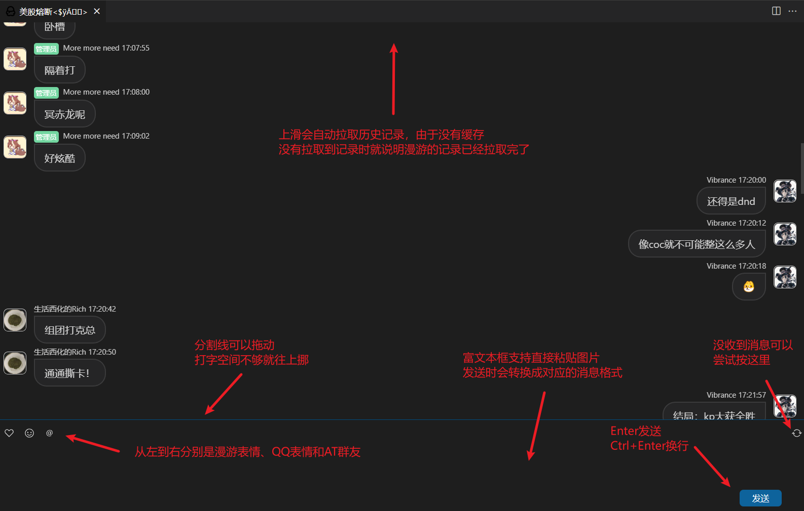

<div align="center">


# QLite

```
在VSCode中使用QQ，让你摸鱼工作两不误
```

</div>

## 特性

- 不在本地保存任何消息记录和图片
- 好友和群聊分组显示
- 新消息置顶显示
- 多账号快捷切换
- 登录验证信息自动抓取
- 与vscode保持一致的UI主题

## 使用

- 首次安装时侧边栏会出现一个QQ图标，点击图标即可启动扩展
- 登录界面包含3种登录方式
  - 账号密码登录：最通用的登录方式，输入账号和密码即可  
    
  - 二维码登录：用手机QQ扫描页面显示的二维码即可登录，但成功率不高，不建议使用  
    
  - `token`登录：在你登录过一次QQ时就会在本地保存一份`token`信息，有了这份信息，你只需要输入账号即可登录，若没有登录记录请不要使用这个登录方式  
    
- 登录成功后即可正常使用  
  
- 页面顶部还有设置和搜索菜单
  - 搜索
    - 可以选择搜索好友或群聊  
      
    - 二级搜索菜单支持按好友备注（如果有，否则按昵称）搜索和按QQ号搜索
  - 设置
    目前支持账号切换和状态切换  
    
    - 账号切换支持快捷切换在当前设备有登录记录的账号，也可以退出到登录界面输入新账号
    - 支持切换的状态有：在线、Q我吧、离开、忙碌、请勿打扰、隐身
- 聊天页面  
  

## 配置

本扩展生成的所有文件都存放在 `$HOME/.qlite` 目录下，目录结构如下：

```
.qlite
│  QQNumber_token
│  QQNumber_token
│  device.json
│  login-record.json
│  qrcode.png
└─image
```

- `QQNumber_token` 就是登录后生成的token信息，删除后就不能使用token登录
- `device.json` 是登录QQ模拟的设备信息，由`icqq`自动生成
- `login-record.json` 包含登录过的登录选项和账号信息，通过此文件实现登录状态的记录和读取
- `qrcode.png` 是使用二维码登录时产生的临时文件，新的二维码会将原文件覆盖
- `image` 文件夹是`icqq`登录后生成的缓存目录，默认不开启缓存，所以文件夹为空

## 常见问题

- QQ日常折磨开发者，版本过低的警告时有发生，此问题由`icqq`处理，所以关于此问题的解决办法：
  1. 等待`icqq`更新修复
  2. 到`icqq`的 [repo](https://github.com/icqqjs/icqq) 查找相关issue解决
  3. ~~爆破腾讯大楼~~
- 目前聊天界面还无法解析视频和音频消息（等换了聊天页面再来处理 ~~咕咕咕~~）

由于此扩展还在开发中，功能并不完善，所以如果你在使用时遇到了问题或者想到了什么点子欢迎提issue告诉我

## 发布历史

- 详细信息请参考 [CHANGELOG.md](./CHANGELOG.md) 文件

## 致谢

- [vscode-qq](https://github.com/takayama-lily/vscode-qq) : 此扩展的前身，由于原作者 [takayama-lily](https://github.com/takayama-lily) 似乎不再维护，所以才有了这个项目，在此特别感谢！
- [LiteWebChat_Frame](https://github.com/MorFansLab/LiteWebChat_Frame) : 继承自 [vscode-qq](https://github.com/takayama-lily/vscode-qq) 使用的UI库（目前正尝试替换为 [webview-ui-toolkit](https://github.com/microsoft/vscode-webview-ui-toolkit) 的UI组件以配合vscode主题）
- [icqq](https://github.com/icqqjs/icqq) : 此扩展实现的所有QQ功能都来自这个API库
